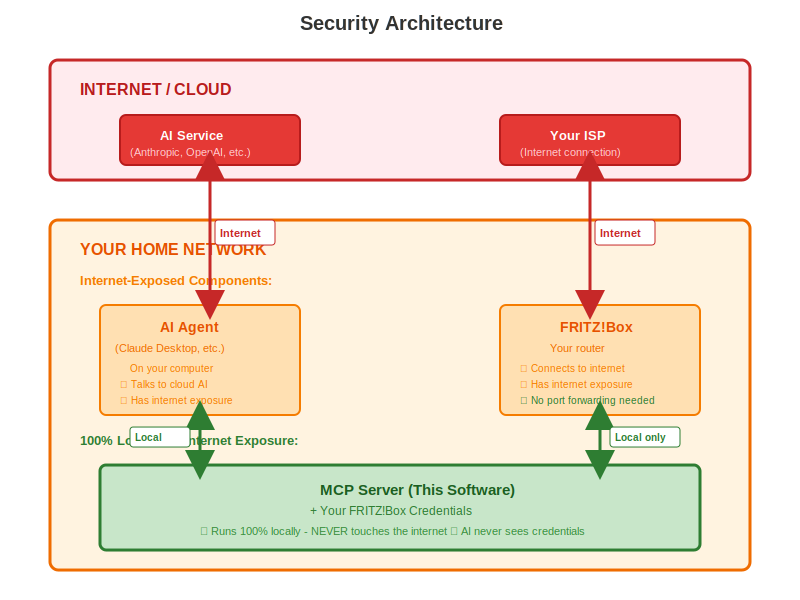

= FRITZ!Box MCP Server

Control your FRITZ!Box router through AI assistants like Claude using natural language.

link:README-de.adoc[🇩🇪 Deutsche Version]

https://mcpservers.org/servers/kambriso/fritzbox-mcp-server[image:https://img.shields.io/badge/Listed%20on-mcpservers.org-0066cc?style=for-the-badge&logo=anthropic[Listed on mcpservers.org]]

== What is this?

This MCP server lets you interact with your FRITZ!Box router using AI assistants. Ask questions in plain language, analyze your network, manage devices, troubleshoot issues, and configure settings without touching the web interface.

== How it works (Security Architecture)

The MCP server runs on your computer and acts as a secure bridge between AI agents (which run in the cloud) and your FRITZ!Box (which stays completely local).

Your FRITZ!Box credentials are stored locally in a `.env` file on your computer. The MCP server uses these credentials to communicate with your FRITZ!Box over your local network only.

The AI agent receives only the results (like "3 devices connected" or "Router uptime: 5 days"), never your credentials or direct access to your router.

Critical security features:

* Your FRITZ!Box never needs internet exposure
* No ports need to be opened
* No cloud connection to your router
* Credentials stay on your computer
* All router communication happens on your local network only

== Why use this?

Works with ALL FRITZ!Box models and firmware versions. When AVM releases new features or models, this server adapts automatically. No updates needed.

Unlike other solutions that break with firmware updates or only work with specific models, this server discovers your router's capabilities in real-time.

== Quick Start

=== 1. Installation

==== Automated Installation (Linux/macOS - Recommended)

Download and install with automatic checksum verification:

[source,bash]
----
curl -fsSL https://raw.githubusercontent.com/kambriso/fritzbox-mcp-server/main/install.sh | sh
----

The installer will:

* Detect your platform (OS and architecture) automatically
* Download the latest release from GitHub
* Verify SHA256 checksums for security
* Install to `~/.local/bin/fritz-mcp`
* Make the binary executable

[TIP]
====
Customize installation:

[source,bash]
----
# Install specific version
FRITZBOX_MCP_VERSION=v0.6.0 curl -fsSL https://raw.githubusercontent.com/kambriso/fritzbox-mcp-server/main/install.sh | sh

# Install to custom directory
FRITZBOX_MCP_INSTALL_DIR=/usr/local/bin curl -fsSL https://raw.githubusercontent.com/kambriso/fritzbox-mcp-server/main/install.sh | sh
----
====

==== Manual Installation (All platforms)

Get the binary for your system from https://github.com/kambriso/fritzbox-mcp-server/releases[Releases]:

Linux:: `fritz-mcp-linux-amd64.tar.xz` or `fritz-mcp-linux-arm64.tar.xz`
macOS:: `fritz-mcp-darwin-amd64.tar.xz` or `fritz-mcp-darwin-arm64.tar.xz`
Windows:: `fritz-mcp-windows-amd64.zip` or `fritz-mcp-windows-arm64.zip`

Extract the archive and make it executable (Linux/macOS):
[source,bash]
----
tar -xJf fritz-mcp-linux-amd64.tar.xz
chmod +x fritz-mcp
----

Windows: Extract the ZIP file.

=== 2. Create Configuration File

Create a file named `.env` with your FRITZ!Box credentials:

[source,bash]
----
FRITZ_HOST=fritz.box
FRITZ_USERNAME=your-username
FRITZ_PASSWORD=your-password
----

Save this file in one of these locations:

Windows:: `%USERPROFILE%\.config\fritzbox-mcp-server\.env`
macOS:: `~/.config/fritzbox-mcp-server/.env`
Linux:: `~/.config/fritzbox-mcp-server/.env`

Or place it in the same folder as the binary for testing.

[WARNING]
====
This file contains your password. Keep it secure and never commit it to version control.

On Linux/macOS, restrict access: `chmod 600 ~/.config/fritzbox-mcp-server/.env`
====

=== 3. FRITZ!Box User Permissions

Your FRITZ!Box user needs full settings access.

In the FRITZ!Box web interface (http://fritz.box):

1. Go to System → FRITZ!Box-Benutzer → [Your User] → Berechtigungen
2. Enable: "FRITZ!Box-Einstellungen" (or "The user can view and edit all FRITZ!Box settings")

=== 4. Configure Claude Desktop

Edit your Claude Desktop config file:

Windows:: `%APPDATA%\Claude\claude_desktop_config.json`
macOS:: `~/Library/Application Support/Claude/claude_desktop_config.json`
Linux:: `~/.config/claude/claude_desktop_config.json`

Add the server:

[source,json]
----
{
  "mcpServers": {
    "fritzbox": {
      "command": "/path/to/fritz-mcp"
    }
  }
}
----

[TIP]
====
Windows: `C:\\Users\\YourName\\path\\to\\fritz-mcp.exe` (note the double backslashes)

macOS/Linux with automated install: `~/.local/bin/fritz-mcp`

macOS/Linux with manual install: Absolute path to where you placed the binary, e.g., `/Users/yourname/bin/fritz-mcp`
====

Restart Claude Desktop.

== What can you do?

=== Ask Questions

"What's my external IP address?"

"Show me all connected devices"

"How long has the router been running?"

"What's my current internet speed?"

"Is my WiFi secure?"

=== Analyze Your Network

"Analyze my network health and tell me if everything looks good"

Claude will check your connection quality, identify issues, explain patterns in your logs, and provide recommendations.

Example response:
[source,text]
----
Network Health Analysis

Connection: Healthy ✓
- Speed: 112 / 37 Mbit/s (down/up)
- Signal quality: Excellent
- No errors detected

Daily Reconnections at 04:00:
This is normal. Your ISP enforces 24-hour session limits.
FRITZ!Box reconnects proactively to avoid forced disconnection.

One DSL resync on Dec 7 at 12:52:
Single event, recovered in 4 minutes. Monitor for recurring
patterns, but not concerning as an isolated incident.

Overall: Network operating optimally.
----

=== Manage Devices

"Show all WiFi devices"

"Which devices are using the most bandwidth?"

"List unknown devices in my network"

"Prioritize my laptop's bandwidth - I have a video call"

=== Parental Controls & Scheduling

"Block the Nintendo Switch in 20 minutes"

"Disable internet for all gaming devices during work hours"

"Enable guest WiFi at 6 PM for the party"

=== Troubleshooting

"Why is my internet slow?"

"Check if there are any connection problems"

"Show me recent disconnections"

== Examples

=== Network Health Check

Prompt: "Analyze my network health and check if everything is running optimally"

Claude autonomously:

1. Queries device info and uptime
2. Checks connection status and stability
3. Analyzes line quality and error rates
4. Reviews logs for patterns
5. Distinguishes normal behavior from issues
6. Provides recommendations

=== Device Inventory

Prompt: "Show me all devices - which are online and are there any unknown devices?"

Claude:

1. Lists all registered devices
2. Categorizes by status (online/offline)
3. Groups by connection type (WiFi/Ethernet)
4. Identifies unknown or suspicious devices
5. Provides security analysis

=== Time-Delayed Actions

Prompt: "Block the gaming console in 20 minutes"

Claude schedules the action to execute automatically, even after you close the chat.

This uses the server's CLI mode for persistent background execution.

== Troubleshooting

=== Cannot connect to FRITZ!Box

Check that your router is reachable:
[source,bash]
----
ping fritz.box
----

Verify credentials in `.env` file.

Ensure your FRITZ!Box user has full settings permission enabled.

=== Claude Desktop doesn't see the server

Verify the path in `claude_desktop_config.json` is absolute and correct.

Windows users: Use double backslashes in paths.

Restart Claude Desktop after config changes.

=== Permission errors

Your FRITZ!Box user needs "FRITZ!Box-Einstellungen" permission enabled. See configuration section above.

== Privacy & Security

All communication stays on your local network. Your credentials are stored locally in a `.env` file and used only to communicate with your FRITZ!Box. The AI receives only the results of operations, never your credentials.

No cloud services. No external servers. Everything runs locally.

=== Binary Verification (v0.5.0)

Independent VirusTotal scans confirm the binaries are clean:

* https://www.virustotal.com/gui/file/3137edfa6438276495399ccdeb58751f1205d38426dbb827969dba299e5a731a[linux-amd64]
* https://www.virustotal.com/gui/file/ace64b3d9dcb47476407938cfc010e888d481da49185c7f392901303d99786ed[linux-arm64]
* https://www.virustotal.com/gui/file/65fb7ccad5d7e83210a788d1fc3e4b9a69c1dbaee2af81ada82fdb0474c26e36[darwin-arm64]
* https://www.virustotal.com/gui/file/c4b0d05b2a4d60bb34d149974779d7115d31f4568dadd4843e6c5b3e275c5c17[windows-amd64]

== Token Usage Considerations

This MCP server exposes **143 tools** to the AI assistant. Each tool definition (name, description, JSON schema) is sent with every message.

=== Impact on Claude Code / Claude API

* **Token overhead**: ~25,000-30,000 tokens per message just for tool definitions
* **Cost estimate**: ~$0.08/message (Sonnet) or ~$0.45/message (Opus) in tool overhead
* **Context usage**: Tool schemas consume context window space that could be used for conversation

=== Recommendations

==== For occasional use
Disable the server when not needed:

[source,bash]
----
# In Claude Code, disable the MCP server:
claude --mcp-server fritzbox=off

# Or remove from mcpServers in ~/.claude.json
----

==== For frequent use
Consider enabling only for specific projects that need router access, rather than globally.

==== For local LLMs
If using this with local models (llama.cpp, Ollama), 143 tools may overwhelm smaller models. Use tool filtering to expose only needed tools.

[TIP]
====
After the first message in a session, Claude's prompt caching reduces the token cost for subsequent messages. The overhead is most significant for short conversations.
====

== Support

Issues:: https://github.com/kambriso/fritzbox-mcp-server/issues
Source Code:: https://github.com/kambriso/fritz-mcp (private)

== License

Copyright (c) 2025 Kambrium Software GmbH. All Rights Reserved.

Free for personal use (single FRITZ!Box). Commercial use requires licensing.

See LICENSE file for complete terms.

[CAUTION]
====
This software is provided as-is. Secure your FRITZ!Box with a strong password and ensure it's not exposed to the internet.
====
