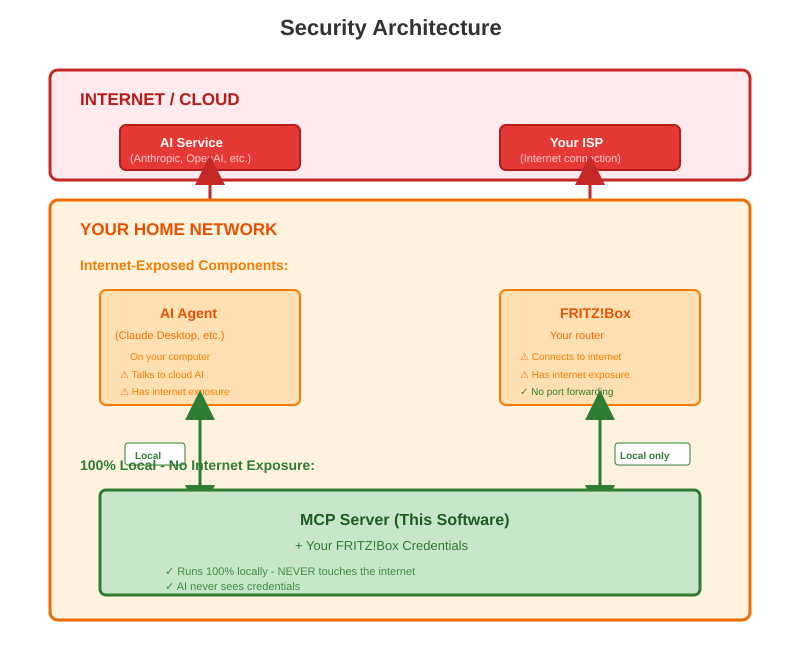

= FRITZ!Box MCP Server
:toc: left
:toclevels: 3
:sectnums:

Control your FRITZ!Box router through AI assistants like Claude using natural language.

link:README-de.adoc[🇩🇪 Deutsche Version] | link:COMPARISON.adoc[Comparison with Other Solutions] | link:CHANGELOG.adoc[Changelog]

https://mcpservers.org/servers/kambriso/fritzbox-mcp-server[image:https://img.shields.io/badge/Listed%20on-mcpservers.org-0066cc?style=for-the-badge&logo=anthropic[Listed on mcpservers.org]]

== Introduction

=== What is this?

This MCP server lets you interact with your FRITZ!Box router using AI assistants. Ask questions in plain language, analyze your network, manage devices, troubleshoot issues, and configure settings without touching the web interface.

=== How it works (Security Architecture)

The MCP server runs on your computer and acts as a secure bridge between AI agents (which run in the cloud) and your FRITZ!Box (which stays completely local).

Your FRITZ!Box credentials are stored locally in a `.env` file on your computer. The MCP server uses these credentials to communicate with your FRITZ!Box over your local network only.

The AI agent receives only the results (like "3 devices connected" or "Router uptime: 5 days"), never your credentials or direct access to your router.

Critical security features:

* Your FRITZ!Box never needs internet exposure
* No ports need to be opened
* No cloud connection to your router
* Credentials stay on your computer
* All router communication happens on your local network only

=== Why use this?

Works with ALL FRITZ!Box models and firmware versions. When AVM releases new features or models, this server adapts automatically. No updates needed.

Unlike other solutions that break with firmware updates or only work with specific models, this server discovers your router's capabilities in real-time.

== User Guide

=== Quick Start

==== 1. Installation

===== Automated Installation (Linux/macOS - Recommended)

Download and install with automatic checksum verification:

[source,bash]
----
curl -fsSL https://raw.githubusercontent.com/kambriso/fritzbox-mcp-server/main/install.sh | sh
----

The installer will:

* Detect your platform (OS and architecture) automatically
* Download the latest release from GitHub
* Verify SHA256 checksums for security
* Install to `~/.local/bin/fritz-mcp`
* Make the binary executable

[TIP]
====
Customize installation:

[source,bash]
----
# Install specific version
FRITZBOX_MCP_VERSION=v0.6.0 curl -fsSL https://raw.githubusercontent.com/kambriso/fritzbox-mcp-server/main/install.sh | sh

# Install to custom directory
FRITZBOX_MCP_INSTALL_DIR=/usr/local/bin curl -fsSL https://raw.githubusercontent.com/kambriso/fritzbox-mcp-server/main/install.sh | sh
----
====

===== Manual Installation (All platforms)

Get the binary for your system from https://github.com/kambriso/fritzbox-mcp-server/releases[Releases]:

Linux:: `fritz-mcp-linux-amd64.tar.xz` or `fritz-mcp-linux-arm64.tar.xz`
macOS:: `fritz-mcp-darwin-amd64.tar.xz` or `fritz-mcp-darwin-arm64.tar.xz`
Windows:: `fritz-mcp-windows-amd64.zip` or `fritz-mcp-windows-arm64.zip`

Extract the archive and make it executable (Linux/macOS):
[source,bash]
----
tar -xJf fritz-mcp-linux-amd64.tar.xz
chmod +x fritz-mcp
----

Windows: Extract the ZIP file.

==== 2. Create Configuration File

Create a file named `.env` with your FRITZ!Box credentials:

[source,bash]
----
FRITZ_HOST=fritz.box
FRITZ_USERNAME=your-username
FRITZ_PASSWORD=your-password
----

Save this file in one of these locations:

Windows:: `%USERPROFILE%\.config\fritzbox-mcp-server\.env`
macOS:: `~/.config/fritzbox-mcp-server/.env`
Linux:: `~/.config/fritzbox-mcp-server/.env`

Or place it in the same folder as the binary for testing.

[WARNING]
====
This file contains your password. Keep it secure and never commit it to version control.

On Linux/macOS, restrict access: `chmod 600 ~/.config/fritzbox-mcp-server/.env`
====

==== 3. FRITZ!Box User Permissions

Your FRITZ!Box user needs full settings access.

In the FRITZ!Box web interface (http://fritz.box):

1. Go to System → FRITZ!Box-Benutzer → [Your User] → Berechtigungen
2. Enable: "FRITZ!Box-Einstellungen" (or "The user can view and edit all FRITZ!Box settings")

==== 4. Configure Claude Desktop

Edit your Claude Desktop config file:

Windows:: `%APPDATA%\Claude\claude_desktop_config.json`
macOS:: `~/Library/Application Support/Claude/claude_desktop_config.json`
Linux:: `~/.config/claude/claude_desktop_config.json`

Add the server:

[source,json]
----
{
  "mcpServers": {
    "fritzbox": {
      "command": "/path/to/fritz-mcp"
    }
  }
}
----

[TIP]
====
Windows: `C:\\Users\\YourName\\path\\to\\fritz-mcp.exe` (note the double backslashes)

macOS/Linux with automated install: `~/.local/bin/fritz-mcp`

macOS/Linux with manual install: Absolute path to where you placed the binary, e.g., `/Users/yourname/bin/fritz-mcp`
====

Restart Claude Desktop.

=== What can you do?

==== Ask Questions

"What's my external IP address?"

"Show me all connected devices"

"How long has the router been running?"

"What's my current internet speed?"

"Is my WiFi secure?"

==== Analyze Your Network

"Analyze my network health and tell me if everything looks good"

Claude will check your connection quality, identify issues, explain patterns in your logs, and provide recommendations.

Example response:
[source,text]
----
Network Health Analysis

Connection: Healthy ✓
- Speed: 112 / 37 Mbit/s (down/up)
- Signal quality: Excellent
- No errors detected

Daily Reconnections at 04:00:
This is normal. Your ISP enforces 24-hour session limits.
FRITZ!Box reconnects proactively to avoid forced disconnection.

One DSL resync on Dec 7 at 12:52:
Single event, recovered in 4 minutes. Monitor for recurring
patterns, but not concerning as an isolated incident.

Overall: Network operating optimally.
----

==== Manage Devices

"Show all WiFi devices"

"Which devices are using the most bandwidth?"

"List unknown devices in my network"

"Prioritize my laptop's bandwidth - I have a video call"

==== Parental Controls & Scheduling

"Block the Nintendo Switch in 20 minutes"

"Disable internet for all gaming devices during work hours"

"Enable guest WiFi at 6 PM for the party"

==== Troubleshooting

"Why is my internet slow?"

"Check if there are any connection problems"

"Show me recent disconnections"

=== Examples

==== Network Health Check

Prompt: "Analyze my network health and check if everything is running optimally"

Claude autonomously:

1. Queries device info and uptime
2. Checks connection status and stability
3. Analyzes line quality and error rates
4. Reviews logs for patterns
5. Distinguishes normal behavior from issues
6. Provides recommendations

==== Device Inventory

Prompt: "Show me all devices - which are online and are there any unknown devices?"

Claude:

1. Lists all registered devices
2. Categorizes by status (online/offline)
3. Groups by connection type (WiFi/Ethernet)
4. Identifies unknown or suspicious devices
5. Provides security analysis

==== Time-Delayed Actions

Prompt: "Block the gaming console in 20 minutes"

Claude schedules the action to execute automatically, even after you close the chat.

This uses the server's CLI mode for persistent background execution.

=== Troubleshooting

==== Cannot connect to FRITZ!Box

Check that your router is reachable:
[source,bash]
----
ping fritz.box
----

Verify credentials in `.env` file.

Ensure your FRITZ!Box user has full settings permission enabled.

==== Claude Desktop doesn't see the server

Verify the path in `claude_desktop_config.json` is absolute and correct.

Windows users: Use double backslashes in paths.

Restart Claude Desktop after config changes.

==== Permission errors

Your FRITZ!Box user needs "FRITZ!Box-Einstellungen" permission enabled. See configuration section above.

=== Privacy & Security

All communication stays on your local network. Your credentials are stored locally in a `.env` file and used only to communicate with your FRITZ!Box. The AI receives only the results of operations, never your credentials.

No cloud services. No external servers. Everything runs locally.

==== Binary Verification (v0.5.0)

Independent VirusTotal scans confirm the binaries are clean:

* https://www.virustotal.com/gui/file/3137edfa6438276495399ccdeb58751f1205d38426dbb827969dba299e5a731a[linux-amd64]
* https://www.virustotal.com/gui/file/ace64b3d9dcb47476407938cfc010e888d481da49185c7f392901303d99786ed[linux-arm64]
* https://www.virustotal.com/gui/file/65fb7ccad5d7e83210a788d1fc3e4b9a69c1dbaee2af81ada82fdb0474c26e36[darwin-arm64]
* https://www.virustotal.com/gui/file/c4b0d05b2a4d60bb34d149974779d7115d31f4568dadd4843e6c5b3e275c5c17[windows-amd64]

=== Token Usage Considerations

This MCP server exposes 143 tools to the AI assistant. Each tool definition (name, description, JSON schema) is sent with every message.

==== Impact on Claude Code / Claude API

* Token overhead: ~25,000-30,000 tokens per message just for tool definitions
* Cost estimate: ~$0.08/message (Sonnet) or ~$0.45/message (Opus) in tool overhead
* Context usage: Tool schemas consume context window space that could be used for conversation

==== Recommendations

===== For occasional use
Disable the server when not needed:

[source,bash]
----
# In Claude Code, disable the MCP server:
claude --mcp-server fritzbox=off

# Or remove from mcpServers in ~/.claude.json
----

===== For frequent use
Consider enabling only for specific projects that need router access, rather than globally.

===== For local LLMs
If using this with local models (llama.cpp, Ollama), 143 tools may overwhelm smaller models. Use tool filtering to expose only needed tools.

[TIP]
====
After the first message in a session, Claude's prompt caching reduces the token cost for subsequent messages. The overhead is most significant for short conversations.
====

== Developer Guide

=== Architecture

This server is runtime-driven and model-agnostic:

* No hardcoded service structures
* Discovers capabilities dynamically from your FRITZ!Box's service descriptors
* Works with firmware updates automatically
* Supports all FRITZ!Box models (tested with 7490, 7590)

=== MCP SDK Choice

This project uses the community MCP SDK (https://github.com/mark3labs/mcp-go[mark3labs/mcp-go] v0.7.0) instead of the official SDK (modelcontextprotocol/go-sdk) due to compatibility issues with Claude Code:

* Official SDK issues: Tools fail to appear in Claude Code despite proper registration
** https://github.com/modelcontextprotocol/go-sdk/issues/395[Issue #395]: Initialization race conditions and client timeouts
** https://github.com/modelcontextprotocol/go-sdk/issues/200[Issue #200]: Schema generation issues with pointer types (fixed in PR #338)
* Community SDK: Battle-tested with Claude Code, no known compatibility issues
* API incompatibility: The two SDKs are not API-compatible (see https://github.com/modelcontextprotocol/go-sdk/blob/main/design/design.md[official SDK design doc])

The official SDK uses a different JSON-RPC implementation and lower-level transport interface. While both SDKs work standalone, the community SDK has proven more reliable for stdio transport with Claude Code clients.

=== Development Setup

==== Prerequisites

* Go 1.25 or later
* A FRITZ!Box router on your local network for testing
* FRITZ!Box username and password

==== Clone and Build

[source,bash]
----
git clone git@github.com:kambriso/fritz-mcp.git
cd fritz-mcp
make help  # See available build targets
----

==== Configuration

Create `.env` file with your FRITZ!Box credentials:

[source,bash]
----
cp .env.example .env
# Edit with your credentials
editor .env
----

Required variables:
[source,bash]
----
FRITZ_HOST=fritz.box          # FRITZ!Box hostname or IP
FRITZ_PORT=49000              # Service port (default: 49000)
FRITZ_USERNAME=your-username  # FRITZ!Box username
FRITZ_PASSWORD=your-password  # FRITZ!Box password
----

==== FRITZ!Box User Permissions

The user account must have FRITZ!Box-Einstellungen permission enabled:

* German: "Der Benutzer kann alle Einstellungen der FRITZ!Box sehen und bearbeiten"
* English: "The user can view and edit all FRITZ!Box settings"

Configure in FRITZ!Box web UI:

`System → FRITZ!Box-Benutzer → [Your User] → Berechtigungen`

Enable the checkbox for "FRITZ!Box-Einstellungen".

=== Building

==== Development Build

[source,bash]
----
make build
./fritz-mcp
----

==== Production Builds

Build for all supported platforms:

[source,bash]
----
make dists
----

This creates binaries in `dist/` for:
* Linux (amd64, arm64, 386, arm)
* macOS (amd64, arm64)
* Windows (amd64, arm64)
* WASI (wasm) - WebAssembly with limited functionality

==== WASI Build Notes

A WASI (WebAssembly System Interface) build is included to demonstrate code portability. However, Go's wasip1 target has significant limitations for network applications:

* ❌ No network access - Go only supports WASI Preview 1, which lacks socket APIs
* ❌ Restricted file system access
* ✅ Provides capability-based security sandbox

NOTE: While WasmEdge supports sockets and WASI Preview 2 includes wasi-sockets, Go currently only targets wasip1 (sealed without networking). WASI Preview 2 launched in January 2024, but Go has no announced timeline for GOOS=wasip2 support (tracked in https://github.com/golang/go/issues/65333[Issue #65333]). Go 1.24 (Feb 2025) and Go 1.25 (Aug 2025) do not include wasip2.

Recommendation: Use native binaries or multi-arch containers for production. The WASI build demonstrates WebAssembly portability but cannot function as a network service with current Go releases.

Build for specific platform:

[source,bash]
----
GOOS=linux GOARCH=amd64 make dist
GOOS=darwin GOARCH=arm64 make dist
GOOS=windows GOARCH=amd64 make dist
----

=== Testing

==== Unit Tests

[source,bash]
----
go test -v ./...
----

==== Integration Test: Device Info

Test your FRITZ!Box connection:

[source,bash]
----
go build -o test-device-info ./cmd/test-device-info
./test-device-info
----

See link:cmd/test-device-info/README.md[cmd/test-device-info/README.md] for details.

==== XML Fetching

Fetch service descriptors without authentication:

[source,bash]
----
./fritz-mcp --fetch-xml
----

This downloads service descriptors to `xml/` directory for offline analysis.

=== Project Structure

[source]
----
.
├── cmd/
│   ├── fritz-mcp/          # Main MCP server binary
│   └── test-device-info/   # Integration test tool
├── xml/                    # Cached service descriptors
├── dist/                   # Built binaries (created by make dist)
├── config.go               # Configuration loading
├── tr064.go               # FRITZ!Box API client implementation
├── spec.go                # Service discovery and spec parsing
├── mcp.go                 # MCP server implementation
├── docs.go                # Documentation index
└── Makefile               # Build targets
----

=== Development Workflow

1. Make changes to source code
2. Run tests: `go test -v ./...`
3. Build: `make build`
4. Test locally with your FRITZ!Box
5. Build distributable binaries: `make dist`

=== Release Process

Releases are automatically published to the public repository when a version tag is pushed.

==== Setup

The `PUBLIC_REPO_TOKEN` secret is configured and ready for releases.

==== Creating a Release

[source,bash]
----
# Ensure all tests pass
make check

# Tag the release (use semantic versioning)
git tag v1.0.0

# Push the tag to trigger the release workflow
git push origin v1.0.0
----

The GitHub Actions workflows will:

Release workflow (link:.github/workflows/release.yml[release.yml]):
1. Build binaries for all platforms (Linux, macOS, Windows, WASI)
2. Generate SHA256 checksums
3. Create a release in https://github.com/kambriso/fritzbox-mcp-server
4. Upload all binaries and checksums

Container workflow (link:.github/workflows/container.yml[container.yml]):
1. Build WASI container image (tagged with `-wasi` suffix)
2. Build multi-arch container (linux/amd64, linux/arm64)
3. Publish to ghcr.io/kambriso/fritzbox-mcp-server

NOTE: Use the multi-arch container for production. The WASI container demonstrates portability but Go's wasip1 target lacks network support (pending wasip2 support in future Go versions).

==== Supported Release Platforms

Binaries::
* Linux: amd64, arm64, 386, arm
* macOS: amd64 (Intel), arm64 (Apple Silicon)
* Windows: amd64, arm64
* WASI: wasm (Go wasip1 - no network support until wasip2)

Container Images::
* Multi-arch: linux/amd64, linux/arm64 (recommended for production)
* WASI: wasm (portability demo - Go wasip1 lacks network APIs)

== Technical Reference

=== Runtime Discovery Architecture

This server is designed to be runtime-driven and model-agnostic. It does not contain any hardcoded service structures.

==== Design Principles

* No static, model-specific Go structs for services
* No dependency on any cloud for auth, logic, or docs
* Discovery of services and actions from runtime service descriptors
* Typed MCP tools generated at runtime from service specifications
* Same MCP binary works with new firmware and models automatically

==== Key Components

===== Config (internal/config)

[source,bash]
----
File: .env (never sent to LLM, local only)

Required keys:
- FRITZ_HOST=fritz.box (or IP)
- FRITZ_PORT=49000
- FRITZ_USERNAME=...
- FRITZ_PASSWORD=...
- FRITZ_TLS=false (optional, for 49443 later)
----

===== API Client (internal/tr064)

Minimal types:

* Client
** BaseURL (http://host:port)
** HTTPClient http.Client
** auth state (nonce, realm, secret, etc.)
* Call(ctx, svc spec.ServiceSpec, act spec.ActionSpec, in map[string]string) (map[string]string, error)

All argument values represented as map[string]string.

Authentication:

* Implements AVM authentication (SOAP/ClientAuth variant)
* First request: without auth → expect challenge response from FRITZ!Box
* Parse nonce/realm/etc. from response
* Compute MD5-based token
* Include proper SOAP auth header in subsequent calls
* Cache auth; on auth failure, retry once with fresh challenge

SOAP and XML handling:

* Use encoding/xml only in this package
* For requests:
** Use ActionSpec.In slice to determine argument order
** Never iterate over Go maps for argument order
** For each ArgSpec in In: look up in[arg.Name] and emit `<arg.Name>value</arg.Name>` in that order
* For responses:
** Parse `<u:ActionNameResponse>`
** Each child element becomes an entry in map[string]string: key = XML element name (e.g. NewModelName), value = inner text

No field names are hardcoded outside this package.

===== Service Spec Registry (internal/spec)

Dynamic spec representation:

[source,go]
----
type ArgSpec struct {
    Name            string   // NewModelName
    Direction       string   // in | out
    RelatedStateVar string
    AllowedValues   []string // from allowedValueList
    DataType        string   // string, ui4, boolean, ...
}

type ActionSpec struct {
    ServiceType string       // urn:dslforum-org:service:DeviceInfo:1
    Name        string       // GetInfo
    In          []ArgSpec
    Out         []ArgSpec
}

type ServiceSpec struct {
    ServiceType string
    ControlURL  string
    SCPDURL     string
    Actions     map[string]*ActionSpec
}

type Registry struct {
    Services map[string]*ServiceSpec
}
----

Load from FRITZ!Box:

Function: `LoadFromFritz(ctx context.Context, c *tr064.Client, baseURL string) (*Registry, error)`

Steps:

1. GET baseURL + "/tr64desc.xml"
2. Parse device and serviceList:
   * For each `<service>`: serviceType, controlURL, SCPDURL
3. For each service:
   * GET SCPDURL
   * Parse SCPD: `<actionList>` into ActionSpec, `<argumentList>` with direction, `<serviceStateTable>` to fill DataType and AllowedValues
4. Build Registry.Services[serviceType] = ServiceSpec

Everything is discovered at runtime, per device and firmware.

===== Typed MCP API (runtime-generated)

On startup, after:

* config.Load
* tr064.Client created
* spec.LoadFromFritz
* optional initial DeviceInfo:GetInfo
* docs index loaded

Build a set of MCP tools in memory from the registry.

For each (serviceType, actionName) you choose to expose:

* Generate one MCP tool definition with:
** name
** JSON input schema
** JSON output schema
** description from docs.Lookup

No compile-time knowledge of DeviceInfo, Hosts, or WLAN required.

Naming strategy:

For mechanical FRITZ-specific naming:

* tool_name = sanitize(serviceType_short + "_" + actionName)

Examples:

* urn:dslforum-org:service:DeviceInfo:1 → deviceinfo
* action GetInfo → deviceinfo_get_info

JSON schemas:

Input JSON (for a given tool):

* Object with properties derived from ActionSpec.In
* Each property name is the argument name (e.g. NewMACAddress)
* Type mapping from DataType:
** string → JSON string
** boolean → JSON boolean
** ui1, ui2, ui4, i4 → JSON number
** allowedValueList → JSON string with enum restriction (optional enforcement)

Output JSON:

* Single object with out_args:

[source,json]
----
{
  "out_args": {
    "NewManufacturerName": "...",
    "NewModelName": "...",
    "NewSoftwareVersion": "...",
    "..."
  }
}
----

===== Introspection and discovery MCP tools

Add tools so the LLM does not have to guess argument and service names.

list_services::
Input: none
+
Output: array of services with service_type and control_url

list_actions::
Input: service_type
+
Output: array of actions with action name, in_args, out_args

describe_action::
Input: service_type, action
+
Output: service_type, action, doc, in_args, out_args

call_action::
Execute any action on the FRITZ!Box. Use list_services and describe_action to discover available actions and their parameters.

==== Runtime flow

At process start:

1. Load .env → config.Config
2. Create tr064.Client
3. LoadFromFritz(...) → Registry
4. Optionally call DeviceInfo:GetInfo to log model and firmware
5. Build docs index (internal/docs)
6. Generate MCP tools from Registry and docs
7. Start MCP server loop (stdio)

At tool call:

* Resolve tool → (serviceType, actionName)
* Map JSON input to map[string]string for in args
* Lookup ServiceSpec and ActionSpec in Registry
* Call tr064.Client.Call(...) using ordered ActionSpec.In
* Convert result map[string]string to JSON out_args

=== Available Services

==== Standard services

* `deviceconfig`
* `deviceinfo`
* `hosts`
* `lanconfigsecurity`
* `lanethernetifcfg`
* `lanhostconfigmgm`
* `lanifconfig`
* `layer3forwarding`
* `mgmsrv`
* `time`
* `userif`
* `wancommonifconfig`
* `wandslifconfig`
* `wandsllinkconfig`
* `wanethlinkconfig`
* `wanipconn`
* `wanpppconn`
* `wlanconfig`

==== FRITZ!-specific extensions (X_AVM-DE / X_)

* `X_AVM-DE_AppSetup`
* `X_AVM-DE_Auth`
* `X_AVM-DE_OnTel`
* `X_AVM-DE_Dect`
* `X_AVM-DE_Filelinks`
* `X_AVM-DE_Homeauto`
* `X_AVM-DE_Homeplug`
* `X_AVM-DE_HostFilter`
* `X_AVM-DE_Media`
* `X_AVM-DE_MyFritz`
* `X_AVM-DE_Remote`
* `X_AVM-DE_Speedtest`
* `X_AVM-DE_Storage`
* `X_AVM-DE_TAM`
* `X_AVM-DE_UPnP`
* `X_AVM-DE_USPController`
* `X_AVM-DE_WANFiber`
* `X_AVM-DE_WANMobileConnection`
* `X_VoIP`
* `X_AVM-DE_WebDAV`

NOTE: Actual availability per device (FRITZ!Box vs Repeater) varies; the runtime client always discovers services from `/tr64desc.xml`.

==== Example Service: deviceinfo

Service name:: `deviceinfo`
Service ID (SCPD):: `urn:DeviceInfo-com:serviceId:DeviceInfo1`

This service exposes general information about the FRITZ! device: manufacturer, model, serial, hardware/firmware version, and uptime.

===== Key action: GetInfo

Returns a snapshot of general device information.

Action name:: `GetInfo`

Output arguments::
Each of these is returned as an "out" parameter by the SOAP action:
+
* `NewManufacturerName` → manufacturer name (e.g. FRITZ!)
* `NewManufacturerOUI` → manufacturer OUI
* `NewModelName` → model name (e.g. FRITZ!Box 5530 Fiber)
* `NewDescription` → human-readable description
* `NewProductClass` → product class
* `NewSerialNumber` → device serial number
* `NewSoftwareVersion` → firmware/software version
* `NewHardwareVersion` → hardware revision
* `NewSpecVersion` → service specification version implemented
* `NewProvisioningCode` → provisioning code (if used)
* `NewUpTime` → device uptime (seconds)
* `NewDeviceLog` → implementation-specific device log string

== Support

Issues:: https://github.com/kambriso/fritzbox-mcp-server/issues
Source Code:: https://github.com/kambriso/fritz-mcp (private)

== License

Copyright (c) 2025 Kambrium Software GmbH. All Rights Reserved.

Free for personal use (single FRITZ!Box). Commercial use requires licensing.

See LICENSE file for complete terms.

[CAUTION]
====
This software is provided as-is. Secure your FRITZ!Box with a strong password and ensure it's not exposed to the internet.
====
